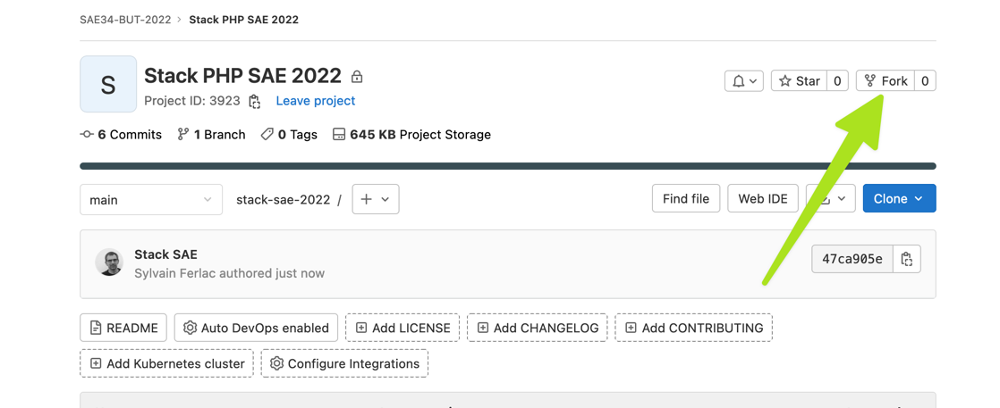

Stack de développement PHP SAE 2022
===================================

Prérequis
---------

Sur votre machine Mac, Windows ou Linux :

- Docker 20.20 au moins
- (Docker) Compose  
  (Installer Docker Desktop satisfait ces deux pré-requis)
- Un éditeur de texte ou un IDE
- L'accès à un terminal

De manière optionnelle, mais fortement recommandée :

- Une [clé SSH](https://forge.iut-larochelle.fr/help/ssh/index#generate-an-ssh-key-pair) active sur votre machine
  (perso) et [ajoutée dans votre compte gitlab](https://forge.iut-larochelle.fr/help/ssh/index#add-an-ssh-key-to-your-gitlab-account) :  
  elle vous permettra de ne pas taper votre mot de passe en permanence.
- PHPStorm  
  _Votre email étudiant vous permet de bénéficier d'une licence complète de 12 mois pour tous les produits JetBrains_  
  ...Mais vous pouvez bien sûr utiliser l'IDE de votre choix.:wq

Démarrage rapide
----------------

UN.E SEUL.E des développeuses/développeurs de votre équipe va **fork** le présent dépôt, pour en créer un nouveau, 
dans le groupe correspondant à votre équipe :  
_Par exemple pour l'équipe 3 du groupe de TP X1, le groupe est : `SAE34-BUT-2022/x1/eq3`_

> Remarque : il n'est pas nécessaire de conserver le lien avec le modèle de stack, vous pouvez donc aller dans  
> Settings > General > Advanced (dans Gitlab) pour supprimer le "Fork relationship" de votre projet

Une fois ce fork réalisé, vous pouvez cloner ce nouveau dépôt sur les postes de travail de chacun des membres de l'équipe, et démarrer la stack :

Dans un terminal :  
`docker compose up --build -d`

Une fois les containers démarrés, vous pouvez vérifier que php fonctionne :  
`docker exec -it sae-php php -v`

Utiliser la base de données
-----------------------------

**Pour utiliser la base de données depuis le container php :**  
_Adresse du serveur_ : `bdd` (c'est le nom du service dans le fichier `docker-compose.yml`)  
_Port_ : 3306 (le port MySQL par défaut)

**Pour utiliser la bdd avec un client MySQL _hors docker_** (par exemple celui de PHPStorm) :  
_Adresse du serveur_ : `localhost`  
_Port_ : 9978

Mot de passe root : `sae`.  
Par ailleurs, un utilisateur "standard" nommé `sae` a les droits d'accès sur une base de données nommée `sae`
avec le mot de passe `sae`

Le serveur web
--------------

Les fichiers du répertoire `/symfony/public` sont servis sur le port 9979  

Démarrer un projet Symfony
--------------------------

Le serveur web est configuré pour qu'un projet symfony soit hébergé dans le répertoire `/symfony`  
La ligne de commande symfony (plus d'infos : https://symfony.com/download) est incluse dans le container `sae-php`

Initialiser le projet revient donc à faire un :  
`rm -Rf public/* && docker exec -it sae-php symfony new --full --version=6.1 --no-git /var/www/html`  
On utilise `--full` pour avoir une appli web complète, et `--no-git` parce que nous allons nous occuper par ailleurs
de la problématique de versionning.  
Le `rm -Rf` est là pour être sûr qu'il n'y a rien dans le répertoire symfony avant d'exécuter la commande.  
Le `/var/www/html` comme dernier argument de l'appel est le nom du répertoire dans lequel on veut créer notre projet. Il _DOIT_ s'appeler `/var/www/html`.

Une fois cette commande exécutée, votre symfony est opérationnel : http://localhost:9979 🎉

Composition de la stack
-----------------------

La stack comporte 3 containers :
- PHP (8.1.10, avec XDebug)
- NginX (2.4.54)
- MariaDB (10.9.2)
